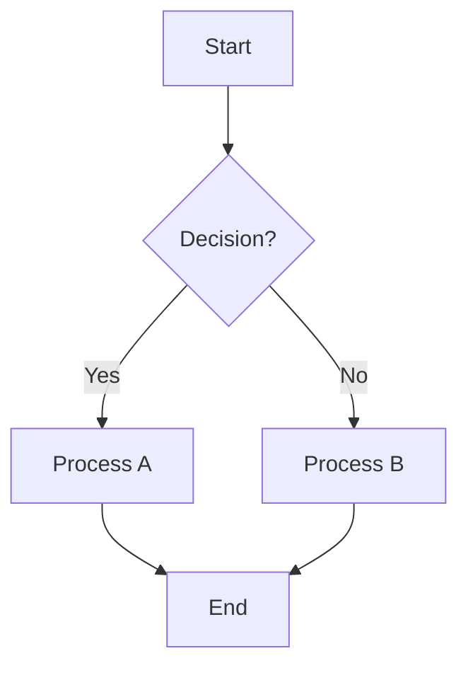

# Arknights Chibi Twitch Bot
A Twitch bot and browser source overlay that displays Arknights chibi characters walking on your stream. Viewers can interact with the bot using chat commands to choose operators, change skins, and play different animations.

## Background
I've been playing (addicted) to a mobile game called Arknights for a couple of years now (since 2023).
It's a mobile tower defense gacha game built by a chinese game company called Hypergryph.
Whilst I was unemployed I tried my hand at streaming on Twitch and this project evolved
out of me wanting to add something unique to my streams. 

In Arknights you gamble for characters (called operators) and they are the "towers" 
you deploy on the map to defend yourself. These characters have little chibi sprites
which have lots of different animations and skins and they even have a walk animation.
I wanted to rip these chibi assets from the Android APK and have them walk around 
as a stream overlay in OBS. Any viewer who then chats in my stream would have their
own little chibi they can play around with. To make it a bit more interactive and 
customizable I added a Twitch Bot to monitor for `!chibi` commands in the chat to allow 
the viewer to change the animations, skins, character, etc.

For details you can checkout the [website](https://akchibibot.stymphalian.top/) and the [github](https://github.com/stymphalian/ak_chibi_bot) repository.

Here is an overview of the tech stack:
 - **Frontend**: React, [Spine](https://esotericsoftware.com/)
 - **Backend**: golang, postgres, Twitch API
 - **Infrastructure**: Docker, Digital Ocean

 ## Overview
 There were multiple parts to this project.
  1. Ripping the Assets from the Android APK.
      1. The game is built in Unity and the characters are animated using a technology called [Spine](https://esotericsoftware.com/)
      1. You need to extract out the `.atlas`, `.skel` and `.png` files for each character
      1. there are a variety of programs on github which allow you to rip out these assets. I won't got into it here as it is actually fairly messy.
  1. The architecture is not that straightforward.

